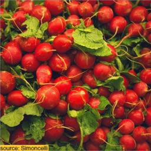
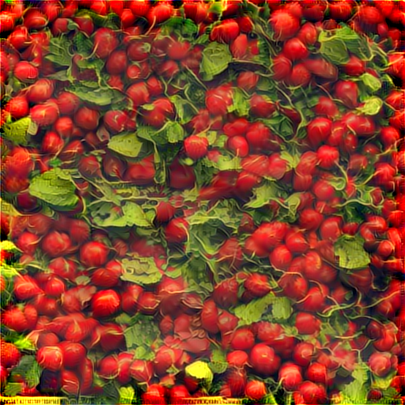
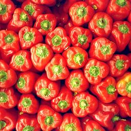
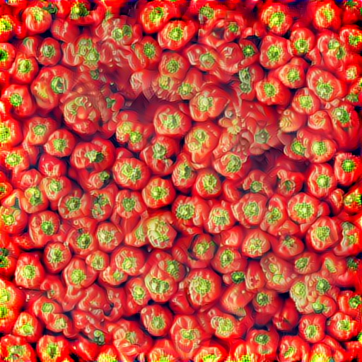

# style_transfer-TF

This is a Tensorflow implementation of papers [Texture Synthesis Using Convolutional Neural](http://papers.nips.cc/paper/5633-texture-synthesis-using-convolutional-neural-networks.pdf) and [A Neural Algorithm of Artistic Style](http://arxiv.org/abs/1508.06576) by Leon A. Gatys, Alexander S.Ecker, and Matthias Bethge.

The former presents an texture synthesis algorithm by modeling the statistics feature extracted from Convolutional Neural Networks. The latter algorithm combines the texture feature, that is , the style, of one so called style image with the content of another content image, and generated a style transfer image. Here are some examples of synthesis texture. 

<table>
	<tr>
		<td><center>*texture sample*</center></td>
		<td><center>*synthesized texture*</center></td>
	</tr>
	<tr>
		<td>
			<center></center>
            		<center> tomato </center></br>
            		<center>use layers from vgg11 to vgg54 to compute style loss</center>
		</td>
		<td>
			<center></center>
		</td>
	</tr>
	<tr>
		<td>
			<center></center>
		    	<center> pepper </center></br>
            		<center>use layers from vgg11 to vgg54 to compute style loss</center>
		</td>
		<td>
			<center></center>
		</td>
	</tr>
<table>

### Dependency
* python3.5
* tensoflow (tested on r1.4)
* VGG19 model weights download from the [TF-slim models](http://download.tensorflow.org/models/vgg_19_2016_08_28.tar.gz) 
* The code is tested on:
	* Ubuntu 16.04 LTS with CPU architecture x86_64 + Nvidia GeForce GTX 1080

### Recommended
* Ubuntu 16.04 with TensorFlow GPU edition

### Getting started 
Denote the directory of this repository as ```./style_transfer-TF/``` 

* #### Run texture synthesis demo  

```bash
# clone the repository from github
git clone https://github.com/LiaoQian1996/style_transfer-TF.git
cd $style_transfer-TF/

# download the vgg19 model weights from 
# http://download.tensorflow.org/models/vgg_19_2016_08_28.tar.gz
# to style_transfer-TF/vgg19/

# run the texture synthesis demo
sh demo.sh
# the result can be viewed at $./results/
```
* #### Synthesis your texture image
```bash
cd $style_transfer-TF/

# put your own png images in $style_transfer-TF/imgs/
```
modify the path in ``` run_syn.sh``` 

```bash
CUDA_VISIBLE_DEVICES=0 python main.py \
    --task_mode texture_synthesis \
    --texture_shape 512 512 \ # set the synthesized texture shape, which will be same as sample's if set as [-1, -1]  
    --output_dir ./results/ \
    --summary_dir ./results/log/ \
    --target_dir ./imgs/your_own_image_name.png \  # your own image, should be .png format and RGB mode   
    --top_style_layer VGG54 \ # VGG 11 21 31 41 51 54
    --max_iter 10000 \
    --save_freq 1000 \ 
    --summary_freq 100 \
    --decay_step 10000 \
    --learning_rate 0.1 \ 
    --decay_rate 0.1 \ # learning_rate will exponential decay 
    --W_tv 0.5 \ # weight of total variation loss
    --vgg_ckpt ./vgg19/vgg_19.ckpt
```
then run the shell script
```
sh run_syn.sh
```

The result can be viewed at $style_transfer-TF/results/ and the output images will be named as  "top-style-layer_iteration-step_style-loss_tv-loss_image-name.png"

Launch tensorboard to monitor the optimization process
```bash
# Launch the tensorboard
cd ./style_transfer-TF/results/
tensorboard --logdir=log
# Then load tensorboard in your browser
```
